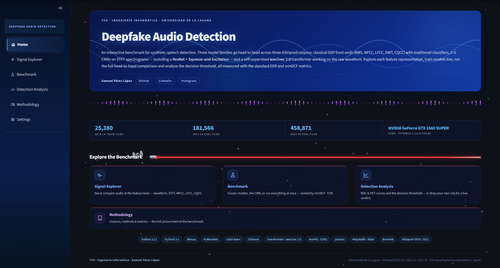
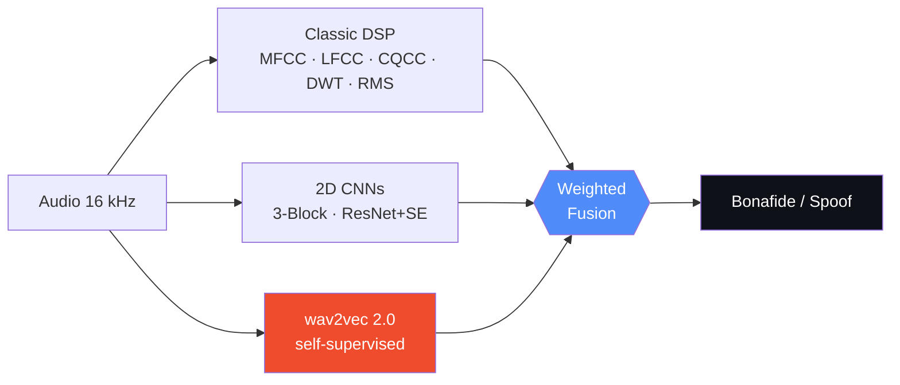
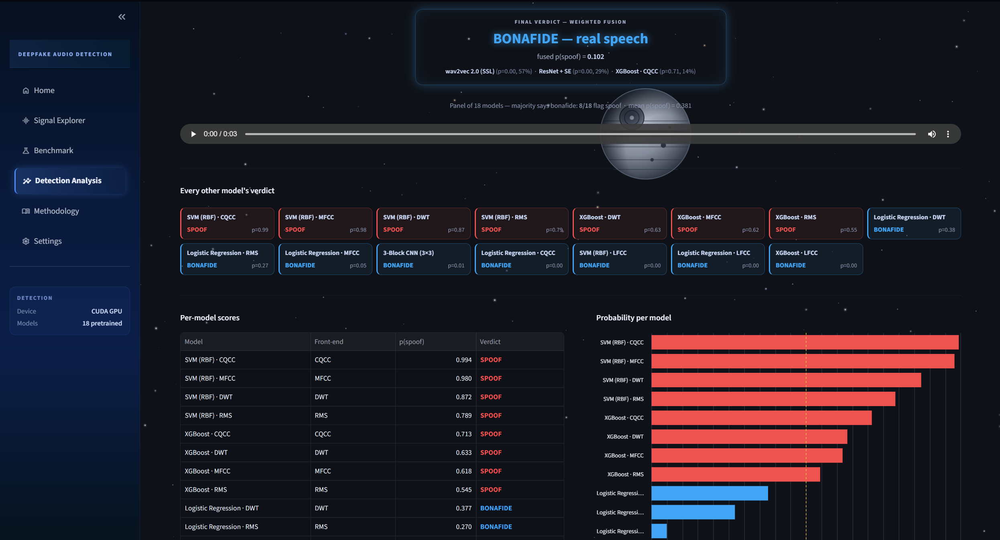

<div align="center">


<a href="https://deepfake-audio-detection-tfg.streamlit.app">
  
</a>

<br/>

### [&nbsp;&nbsp;Try the live demo&nbsp;&nbsp;](https://deepfake-audio-detection-tfg.streamlit.app)

<br/>

[](https://deepfake-audio-detection-tfg.streamlit.app)
[](https://www.python.org/)
[](https://pytorch.org/)
[](https://huggingface.co/)

[](https://github.com/Sampeerez/Deepfake-Audio-Detection/actions/workflows/ci.yml)

[](LICENSE)
[-8A2BE2)](#)

<sub><b>Final Degree Project (TFG)</b> &nbsp;·&nbsp; Computer Engineering — <i>Ingeniería Informática</i></sub>
<br/>
<sub>Samuel Pérez López &nbsp;·&nbsp; Universidad de La Laguna</sub>

<br/><br/>



</div>

---

<div align="center">

### Three generations of anti-spoofing in one web app — no command line, no setup.

</div>



---

## Results that matter

Best of each family on the **ASVspoof 2019 LA eval** set — lower is better:

| # | Model | Type | Front-end | EER&nbsp;(%) | minDCF |
|:---:|---|---|---|:---:|:---:|
| **1** | **wav2vec 2.0 (SSL)** | Self-supervised | Raw waveform | **4.96** | **0.674** |
| 2 | 3-Block CNN (3×3) | 2D CNN | STFT-dB spectrogram | 9.81 | 0.972 |
| 3 | ResNet + SE | 2D CNN + attention | STFT-dB spectrogram | 10.78 | 0.954 |
| 4 | SVM (RBF) · CQCC | Classic ML | CQCC | 12.84 | 0.985 |

> **The headline finding:** the self-supervised model reaches **less than half**
> the EER of the best classic detector. Full per-model, per-corpus metrics live in
> [`leaderboard.json`](leaderboard.json).

### Generalization to unseen conditions

The real test is **2021**, never seen in training — telephone codecs (LA) and
deepfakes *in the wild* (DF). EER (%) per corpus, lower is better:

| Model | 2019 LA | 2021 LA | 2021 DF |
|---|:---:|:---:|:---:|
| **wav2vec 2.0 (SSL)** | **4.96** | **13.04** | **13.51** |
| ResNet + SE | 10.78 | 25.34 | 30.06 |
| 3-Block CNN (3×3) | 9.81 | 27.83 | 34.50 |

> Under domain shift the spectrogram CNNs **collapse** (EER 25–34%), while the
> self-supervised model **stays near 13%** — roughly half the error of the next
> best. This robustness to unseen attacks is the core argument of the project.

**The "Test an audio" verdict** is a weighted late-fusion of the most trustworthy
families. The classic slot is resolved at runtime to whichever classic model
ranks best by EER — currently **SVM · CQCC**. The design weights (0.40 / 0.20 /
0.10) sum to 0.70, so they renormalize to these percentages:

```
verdict   =   57%   · wav2vec2 +   29%   · ResNet+SE +   14%   · best classic (SVM·CQCC)
```

<div align="center">

</div>

---

## What you can do

<div align="center">

| Page | What it gives you |
|---|---|
| **Home** | The project at a glance: corpora, methodology, key metrics. |
| **Signal Explorer** | Visualize waveform + every spectral view (STFT-dB, CNN input, MFCC, LFCC, CQCC), or pit a **real voice against a deepfake** side by side. |
| **Benchmark** | Three modes — **Classic** (DSP × classifier), **CNN** (train live, loss curves per epoch) and **Full comparison** (all 18 models, leaderboard). |
| **Detection Analysis** | **Test an audio** — drop a clip, every model scores it in parallel, weighted-fusion verdict. **Analyse on a split** — *why* a detector gets its EER: score distributions, ROC/DET curves, interactive threshold. |
| **Methodology** | The full reference: corpora, DSP front-ends, classifiers, architectures, metrics. |
| **Settings** | **Light / Dark Side** theme, animated background, accessibility, and a few easter eggs. |

</div>

---

## The detector zoo — 18 models, 3 families

<table>
<tr>
<td width="33%" valign="top">

### Classic ML
**15 models** = 3 classifiers × 5 front-ends

`Logistic Regression`
`SVM (RBF + Platt)`
`XGBoost`

× &nbsp; RMS · MFCC · LFCC · DWT · CQCC

</td>
<td width="33%" valign="top">

### 2D CNNs
On STFT-dB spectrograms

`3-Block CNN (3×3)`
`ResNet + SE` — *4 residual blocks, channel attention, SpecAugment*

</td>
<td width="33%" valign="top">

### Self-supervised
Raw 16 kHz waveform

`wav2vec 2.0` — *HF base, 12 layers, fine-tuned + linear head, T=2.0, inference-only*

</td>
</tr>
</table>

<details>
<summary><b>DSP front-ends — what each one captures</b></summary>

<br/>

| Front-end | Dim. | Idea |
|---|:---:|---|
| **RMS Temporal** | 2 | Per-frame power mean & variance. A deliberately weak baseline. |
| **MFCC** | 40 | Mel-scale cepstrum. Perceptual; loses high-frequency detail. |
| **LFCC** | 40 | **Linear** filter bank cepstrum. Keeps the high band where vocoder artefacts live. |
| **DWT (db4)** | 4 | Multi-resolution wavelet energy; better temporal resolution than STFT. |
| **CQCC** | 26 | Constant-Q cepstrum; logarithmic frequency resolution. |

> **TFG hypothesis:** high-band features (LFCC, CQCC) beat perceptual ones (MFCC),
> and end-to-end models (CNN, wav2vec 2.0) beat any fixed DSP pipeline.

</details>

---

## Quick start

```bash
git clone https://github.com/Sampeerez/Deepfake-Audio-Detection.git
cd Deepfake-Audio-Detection

python3 -m venv .venv && source .venv/bin/activate   # Windows: .venv\Scripts\activate
pip install -r requirements.txt

streamlit run app.py        # opens http://localhost:8501
```

> **Streamlit Cloud (CPU-only):** `requirements.txt` is enough. If the CUDA
> `torch` wheel exceeds resource limits, uncomment the two CPU-wheel lines at the
> top of `requirements.txt`.

---

## Tests & CI

**88 tests, ~15 s, 100% synthetic data** — no corpus, no GPU, runs anywhere.

```bash
pytest                             # full suite
pytest tests/test_metrics.py -v    # one module, verbose
```

<details>
<summary><b>What each test module covers</b></summary>

<br/>

| Module | Validates |
|---|---|
| `test_metrics.py` | EER & minDCF: perfect/random separation, order-invariance, error guards, cost sensitivity. |
| `test_features.py` | Exact dims of every DSP front-end, fusion, spectrogram z-score, audio load/pad contract. |
| `test_models.py` | Classic factory (calibrated probs, reproducibility) + forward pass of CNN, ResNet+SE, wav2vec 2.0. |
| `test_data_loader.py` | 2019/2021 protocol parsing, stratified subsampling, both PyTorch `Dataset`s. |
| `test_pipeline.py` | Feature-matrix extraction, classic train/eval, CNN & raw-waveform inference scorers. |
| `test_pages_smoke.py` | Headless render of every page + benchmark mode (Streamlit `AppTest`) — catches UI/import regressions. |

</details>

Every push and PR to `main` runs the suite on **Python 3.11 & 3.12** via
[GitHub Actions](.github/workflows/ci.yml) — status shown in the CI badge above.

---

## Corpora

<div align="center">

| Corpus | Split | Character |
|---|---|---|
| **ASVspoof 2019 LA** | train / dev / eval | *Logical Access*: studio-grade TTS & voice conversion. The training base. |
| **ASVspoof 2021 LA** | eval | Real **telephone-channel** conditions (codecs, transmission). |
| **ASVspoof 2021 DF** | eval | Deepfakes *in the wild*, three partitions, high attack diversity. |

</div>

> Audio is **16 kHz / 16-bit PCM** (Nyquist = 8 kHz). The corpora are multi-GB and
> **not shipped** with the repo — without them the app still runs fully on the
> bundled `samples/` clips and HF-streamed eval splits (exactly how the cloud demo
> works). To run locally on real data, extract ASVspoof 2019 LA into
> `data/ASVspoof2019/LA/` (2021 paths in [`config/config.yaml`](config/config.yaml)).
> See the [official challenge site](https://www.asvspoof.org/).

---

<details>
<summary><b>Project structure</b></summary>

<br/>

```
Deepfake-Audio-Detection/
├── app.py                      # Entry point: page config, global CSS, navigation, animated background
├── app_pages/
│   ├── 0_Home.py               # Landing
│   ├── 1_Signal_Explorer.py    # Signal visualization & comparison
│   ├── 2_Benchmark.py          # Launcher for the three benchmark modes
│   ├── 3_Detection_Analysis.py # Test an audio + Analyse on a split
│   ├── 4_Methodology.py        # Full reference
│   ├── 5_Settings.py           # Theme, background, accessibility
│   └── modes/                  # _mode_classic / _mode_cnn / _mode_full
├── src/
│   ├── data_loader.py          # Protocol parsers + PyTorch Datasets (spectrogram & raw wave)
│   ├── features.py             # DSP extractors (RMS, MFCC, LFCC, DWT, CQCC, STFT)
│   ├── models.py               # Classic classifiers, 2D CNN, ResNet+SE, Wav2Vec2Classifier
│   ├── pipeline.py             # Extraction, training & evaluation
│   ├── metrics.py              # EER & minDCF (pure Python)
│   ├── jobs.py                 # Background tasks (benchmark sweeps)
│   ├── reporting.py            # Result tables & CSV export
│   ├── model_registry.py       # Config, corpus/sample loading, model registry, HF, loaders
│   ├── leaderboard.py          # leaderboard.json loading
│   ├── ui/                     # UI layer: styles (CSS/theme) · figures · components
│   └── ui_helpers.py           # Thin facade re-exporting ui/ + model_registry + leaderboard
├── static/                     # styles.css (page stylesheet) + canvas.js (animated background)
├── models/                     # 15 classic .joblib + resnet.pth + cnn3x3.pth (wav2vec2.pth from HF)
├── samples/                    # Example clips per corpus/subset (app always has audio)
├── config/config.yaml          # Signal, CNN & corpus-path parameters
├── tests/                      # Test suite (metrics, features, models, data_loader, pipeline, page smoke)
├── leaderboard.json            # Full per-model × split metrics (feeds Full comparison)
├── pytest.ini                  # pytest config
├── .github/workflows/ci.yml    # Continuous integration (GitHub Actions)
├── .streamlit/config.toml      # Base theme & server config
└── requirements.txt
```

</details>

<details>
<summary><b>Model weights — why wav2vec 2.0 comes from Hugging Face</b></summary>

<br/>

The **model zoo is versioned in the repo** (`models/`): the 15 classic `.joblib`
estimators (a few KB each) plus the two CNNs (`resnet.pth`, `cnn3x3.pth`) — loaded
instantly, no download.

The **only exception** is the **wav2vec 2.0** checkpoint (~469 MB), which exceeds
GitHub's 100 MB hard limit:

- **Locally** — read from `models/wav2vec2.pth`.
- **In the cloud** — fetched on first run from a public HF repo
  (`Sara1708/deepfake-audio-wav2vec2 -> stage2_best.pt`).

This exception is encoded in [`.gitignore`](.gitignore); every other model is committed.

</details>

<details>
<summary><b>Configuration & metrics</b></summary>

<br/>

All physical signal parameters live in [`config/config.yaml`](config/config.yaml) —
the code never hard-codes magic numbers.

| Parameter | Value | Meaning |
|---|:---:|---|
| `sample_rate` | 16000 Hz | Sampling rate (Nyquist = 8 kHz). |
| `n_fft` / `hop_length` | 1024 / 512 | FFT window & hop (50% overlap). |
| `cnn_input` | 128 × 300 | Frequency bins × time frames (≈ 9.6 s). |
| `epochs` / `batch_size` / `lr` | 20 / 32 / 1e-3 | CNN training (Adam). |
| `semilla` | 42 | Global reproducibility seed. |

**Metrics:** **EER** (equal error rate, the headline metric, pure Python) ·
**minDCF** (NIST cost: `C_miss=1`, `C_fa=10`, `P_target=0.05`) · **Accuracy**
(context only, misleading under the ~1:9 class imbalance).

</details>

---

## References & resources

<details>
<summary><b>Papers, datasets & learning resources that shaped this project</b></summary>

<br/>

**Key academic references**

- K. Schäfer & M. Steinebach. *MFCC vs. LFCC for Audio Deepfake Detection: The Role of Delta Features and Input Length.* ACM Workshop on Information Hiding and Multimedia Security (IH&MMSec), 2023, pp. 576–581.
- A. Baevski, H. Zhou, A. Mohamed & M. Auli. *wav2vec 2.0: A Framework for Self-Supervised Learning of Speech Representations.* NeurIPS, 2020.
- M. Todisco et al. *ASVspoof 2019: Future Horizons in Spoofed and Fake Audio Detection.* Interspeech, 2019.
- J. Yamagishi et al. *ASVspoof 2021: Accelerating Progress in Spoofed and Deepfake Speech Detection.* ASVspoof Workshop, 2021.
- T. Kinnunen et al. *t-DCF: a Detection Cost Function for the Tandem Assessment of Spoofing Countermeasures and ASV.* Speaker Odyssey, 2018 — [talk](https://umotion.univ-lemans.fr/video/3641-odyssey-2018-t-dcf-a-detection-cost-function-for-the-tandem-assessment-of-spoofing-countermeasures-and-automatic-speaker-verification/).
- J. Hu, L. Shen & G. Sun. *Squeeze-and-Excitation Networks.* CVPR, 2018. *(channel attention in ResNet + SE)*
- D. S. Park et al. *SpecAugment: A Simple Data Augmentation Method for Automatic Speech Recognition.* Interspeech, 2019.

**Datasets & benchmark**

- ASVspoof challenge — corpora 2019 LA and 2021 LA / DF — [asvspoof.org](https://www.asvspoof.org/).

**Learning resources**

- Valerio Velardo — *The Sound of AI* (audio deep learning & DSP) — [playlist](https://www.youtube.com/playlist?list=PLwATfeyAMNqIee7cH3q1bh4QJFAaeNv0).
- Carlos Santana — *DotCSV* — [channel](https://www.youtube.com/@DotCSV).
- *3Blue1Brown* — Neural Networks series — [playlist](https://www.youtube.com/playlist?list=PLZHQObOWTQDNU6R1_67000Dx_ZCJB-3pi).
- *StatQuest* — [channel](https://www.youtube.com/@statquest) · *Explaining AI* — [channel](https://www.youtube.com/@Explaining-AI) · *Linkfy Dev* — [channel](https://www.youtube.com/@Linkfydev) · *PyNinja* — [channel](https://www.youtube.com/@pyninja).

</details>

---

## Built with

<div align="center">


**DSP & audio** · librosa, SciPy, PyWavelets, soundfile &nbsp;|&nbsp;
**ML** · scikit-learn, XGBoost, PyTorch, Transformers &nbsp;|&nbsp;
**App** · Streamlit, Altair, Matplotlib, pandas

</div>

---

<div align="center">

### [&nbsp;&nbsp;Launch the live demo&nbsp;&nbsp;](https://deepfake-audio-detection-tfg.streamlit.app)

<sub><b>Samuel Pérez López</b> &nbsp;·&nbsp; Universidad de La Laguna</sub>
<br/>
<sub><b>Final Degree Project (TFG)</b> &nbsp;·&nbsp; Computer Engineering — <i>Ingeniería Informática</i> &nbsp;·&nbsp; Licensed under <a href="LICENSE">MIT</a></sub>


</div>
